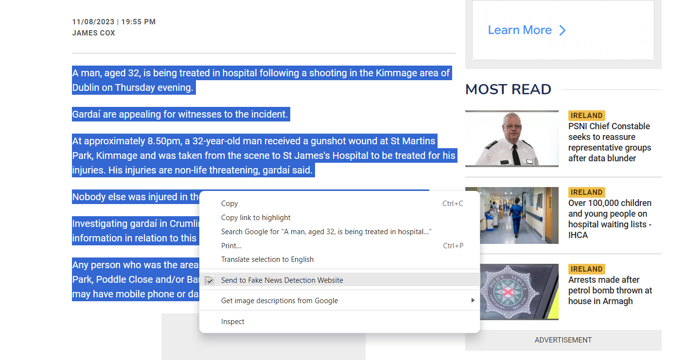
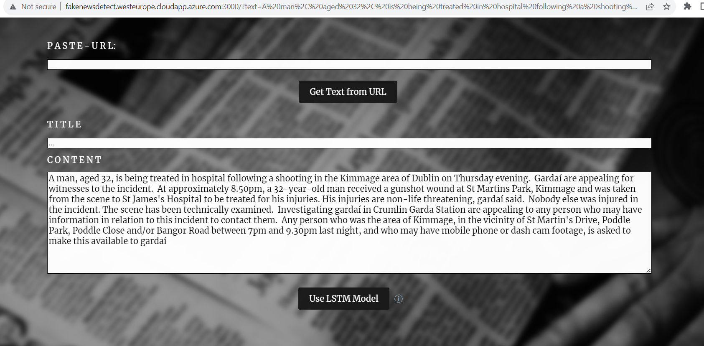

# Getting started with "To Fake News Detection" Chromium Extension

- Go to a random web page
- Select the text which you want to identify whether its genuine or fake
- Right Click and Select "Send to fake news Detection Website" from the right click menu

- Fake News Detection website will be launched with the selected text in the "Content" text box of the website.

# To Download the extension from Google Chrome Web Store, use the following link

https://chrome.google.com/webstore/detail/to-fake-news-detection/idplbimofaidbkabdmepgmhldmjepajj?hl=en-GB